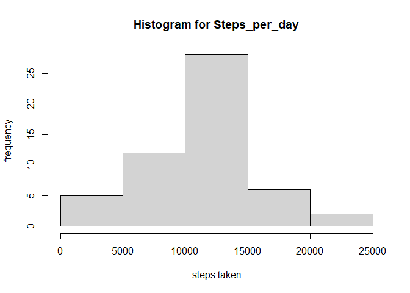
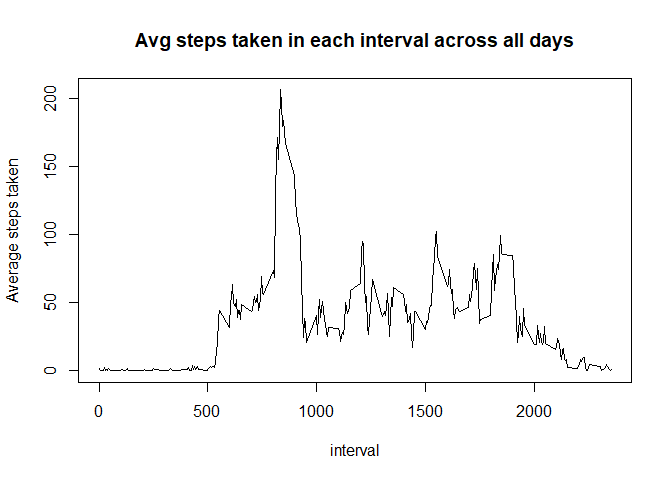
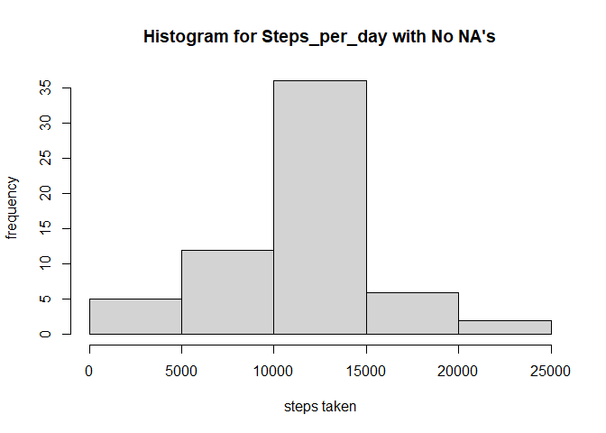
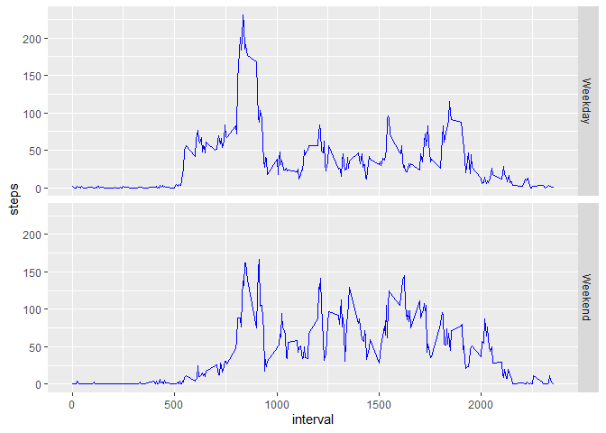

## Loading and preprocessing the data

```r
activity <- read.csv("./activity.csv")
activity$date <- as.Date(activity$date, "%Y-%m-%d")
activity$day <- as.factor(activity$date)
```
## What is mean total number of steps taken per day?


#### Histogram for steps taken per day 

```r
options(scipen = 999)
steps_day <- aggregate(formula = steps ~ day, FUN = sum, data = activity)
hist(steps_day$steps,xlab = "steps taken",ylab = "frequency", main = "Histogram for Steps_per_day")
```

<!-- -->


#### Mean and Median values of steps/day

```r
m1 <- mean(steps_day$steps, na.rm = T)
m2 <- median(steps_day$steps, na.rm = T)
```
**mean_steps_per_day** = 10766.1886792

**median_steps_per_day** = 10765

## What is the average daily activity pattern?

#### Time series plot for avg steps/ interval across all days

```r
step_int <- aggregate(formula = steps ~ interval,FUN = mean,data = activity)
plot(steps ~ interval, type = "l", data = step_int, ylab = "Average steps taken", main = "Avg steps taken in each interval across all days")
```


<!-- -->

## Imputing missing values

#### No of missing values

```r
missing <- sum(is.na(activity$steps))
missing
```

```
## [1] 2304
```

#### Filling up missing values

##### I am going to fill the missing rows with mean steps per interval for that row

```r
 getStepsPerDay <- function(interval){
        step_int[step_int$interval == interval,]$steps      
 }
```
#### Creating new Data

```r
steps_day$day <- as.Date(steps_day$day)
activityFull <- activity
for(i in 1: nrow(activityFull)){
        if(is.na(activityFull[i,]$steps)){
                activityFull[i,]$steps <-     getStepsPerDay(activityFull[i,]$interval)
        }
}
```
#### histogram 

```r
options(scipen = 999)
steps_day2 <- aggregate(formula = steps ~ day, FUN = sum, data = activityFull)
hist(steps_day2$steps,xlab = "steps taken",ylab = "frequency", main = "Histogram for Steps_per_day with No NA's")
```

<!-- -->


#### mean and median values of steps/day

```r
m3 <- mean(steps_day2$steps, na.rm = T)
m4 <- median(steps_day2$steps, na.rm = T)
```
**mean_steps_per_day without NA** = 10766.1886792

**median_steps_per_day without NA** = 10766.1886792

## Are there differences in activity patterns between weekdays and weekends?

```r
suppressMessages(library(dplyr))
suppressMessages(library(ggplot2))
```

```
## Warning: package 'ggplot2' was built under R version 4.0.2
```

```r
activityFull <- mutate(activityFull, weekday = (weekdays(activityFull$date)))
for(i in 1: nrow(activityFull)){
        if(activityFull[i,]$weekday %in% c("Saturday", "Sunday"))activityFull[i,]$weekday <- "Weekend"
        else{
                activityFull[i,]$weekday <- "Weekday"
        }
}
activityFull$weekday <- as.factor(activityFull$weekday)
new <- aggregate(steps~ weekday + interval, data = activityFull, FUN = mean)
g <- ggplot(new, aes(interval, steps))+ geom_line(col = "blue")+ facet_grid(weekday~.)
g
```

<!-- -->
